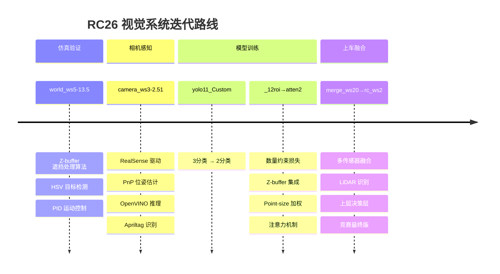

# 👋 你好，我是 Han0301

**RC26 机器人竞赛视觉系统开发者** · 多传感器融合 · YOLOv11 自定义模型 · ROS Noetic

---

### 🏆 项目总览

<table align="center">
<tr>
<td width="33%" align="center">

 <b>🧪 Z-buffer 仿真感知</b>
 10 个版本的仿真→实车算法迭代
</td>
<td width="33%" align="center">

 <b>📷 相机视觉感知</b>
 8 个版本的 RealSense 相机管线
</td>
<td width="33%" align="center">

 <b>🧠 YOLOv11 自定义模型</b>
 6 个版本的注意力机制演进
</td>
</tr>
<tr>
<td width="33%" align="center">

 <b>🔗 上车融合代码</b>
 12 个版本的多传感器融合系统
</td>
<td width="33%" align="center">

 <b>📦 已发布版本</b>
 camera/v2.51 · merge/v39.8 · yolo/v2.1
</td>
<td width="33%" align="center">

 <b>📂 全部仓库</b>
 点击查看所有项目
</td>
</tr>
</table>

---

 

### 📊 项目演进历程

 

### 🛠️ 技术栈

 

### 📈 GitHub 统计

 

### 🏅 版本里程碑

| 领域 | 稳定版本 | 最新版本 | 亮点 |
|------|---------|---------|------|
| 🧪 **Z-buffer 仿真** | `world_ws/v9.0` | `world_ws/v13.5` | 遮挡处理 + PID 控制 |
| 📷 **相机感知** | `camera/v2.4` | `camera/v2.51` | Apriltag R1 识别 |
| 🧠 **YOLO 模型** | `yolo/v2.0` | `yolo/v2.1` | LocalGrid 注意力 |
| 🔗 **上车融合** | `merge/v39.8` | `rc/v2` | 竞赛最终版系统 |

 

---

⭐ **从仿真到实车，从感知到融合，从训练到部署 — 完整的机器人竞赛视觉系统。**

